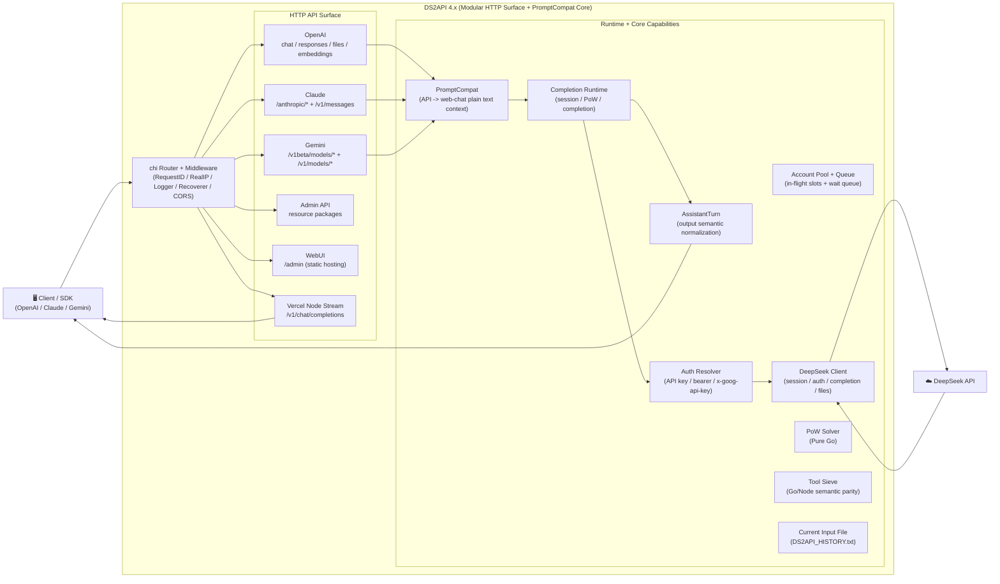

<p align="center">
  
</p>

# DS2API

<a href="https://trendshift.io/repositories/24508" target="_blank"></a>

[](LICENSE)


[](https://github.com/CJackHwang/ds2api/releases)
[](docs/DEPLOY.en.md)
[](https://zeabur.com/templates/L4CFHP)
[](https://vercel.com/new/clone?repository-url=https://github.com/CJackHwang/ds2api)

Ngôn ngữ / Language: [中文](README.zh.md) | [English](README.en.md) | [Tiếng Việt](README.MD)

DS2API chuyển đổi năng lực chat DeepSeek Web thành API tương thích OpenAI, Claude và Gemini. Backend lõi được viết bằng **Go**, có thêm một bridge Node Runtime nhỏ cho streaming trên Vercel, và bảng quản trị React WebUI nằm trong `webui/` (khi deploy sẽ tự build ra `static/admin`).

Tài liệu: [Mục lục docs](docs/README.md) / [Kiến trúc](docs/ARCHITECTURE.en.md) / [Tham chiếu API](API.en.md)

> **Tuyên bố miễn trừ quan trọng**
>
> Kho này chỉ dành cho học tập, nghiên cứu, thử nghiệm cá nhân và xác minh nội bộ. Dự án không cấp bất kỳ quyền sử dụng thương mại nào và không bảo đảm về tính phù hợp, độ ổn định hay kết quả.
>
> Tác giả và maintainers không chịu trách nhiệm cho mọi thiệt hại trực tiếp hoặc gián tiếp, khóa tài khoản, mất dữ liệu, rủi ro pháp lý hoặc khiếu nại từ bên thứ ba phát sinh từ việc sử dụng, chỉnh sửa, phân phối, triển khai hoặc phụ thuộc vào dự án này.
>
> Không dùng dự án theo cách vi phạm điều khoản dịch vụ, thỏa thuận, pháp luật hoặc quy định nền tảng. Trước mọi mục đích thương mại, hãy tự kiểm tra `LICENSE`, các điều khoản liên quan và xác nhận bạn có sự cho phép bằng văn bản của tác giả.

## Mục lục

- [Tổng quan kiến trúc](#tổng-quan-kiến-trúc)
- [Năng lực chính](#năng-lực-chính)
- [Ma trận tương thích nền tảng](#ma-trận-tương-thích-nền-tảng)
- [Hỗ trợ model](#hỗ-trợ-model)
- [Bắt đầu nhanh](#bắt-đầu-nhanh)
- [Cấu hình](#cấu-hình)
- [Chế độ xác thực](#chế-độ-xác-thực)
- [Mô hình đồng thời](#mô-hình-đồng-thời)
- [Thích ứng Tool Call](#thích-ứng-tool-call)
- [Capture gói tin khi dev](#capture-gói-tin-khi-dev)
- [Chỉ mục tài liệu](#chỉ-mục-tài-liệu)
- [Kiểm thử](#kiểm-thử)
- [Tự động build artifact release](#tự-động-build-artifact-release)
- [Miễn trừ trách nhiệm](#miễn-trừ-trách-nhiệm)

## Tổng quan kiến trúc



Chi tiết kiến trúc và trách nhiệm từng thư mục xem trong [docs/ARCHITECTURE.en.md](docs/ARCHITECTURE.en.md).

- **Backend**: Go (`cmd/ds2api/`, `api/`, `internal/`), không cần Python runtime.
- **Frontend**: bảng quản trị React (`webui/`), phục vụ dưới dạng static build khi chạy.
- **Triển khai**: chạy local, Docker, Vercel serverless, Linux systemd.

## Năng lực chính

| Năng lực | Chi tiết |
| --- | --- |
| Tương thích OpenAI | `GET /v1/models`, `POST /v1/chat/completions`, `POST /v1/responses`, `POST /v1/embeddings`, `POST /v1/files` |
| Tương thích Claude | `GET /anthropic/v1/models`, `POST /anthropic/v1/messages`, `POST /anthropic/v1/messages/count_tokens` |
| Tương thích Gemini | `POST /v1beta/models/{model}:generateContent`, `POST /v1beta/models/{model}:streamGenerateContent` |
| Tương thích Ollama | `GET /api/version`, `GET /api/tags`, `POST /api/show` |
| CORS thống nhất | `/v1/*`, `/anthropic/*`, `/v1beta/models/*`, `/api/*`, `/admin/*` dùng cùng chính sách CORS |
| Luân phiên nhiều tài khoản | Tự làm mới token, hỗ trợ đăng nhập email/số điện thoại |
| Kiểm soát đồng thời | Giới hạn in-flight từng tài khoản + hàng đợi, tính concurrency đề xuất động |
| DeepSeek PoW | Bộ giải PoW thuần Go hiệu năng cao (DeepSeekHashV1) |
| Tool Calling | Chống leak, phát `delta.tool_calls` sớm, output tăng dần có cấu trúc |
| Admin API | Quản lý cấu hình, hot-reload runtime settings, proxy, kiểm thử tài khoản, import/export, Vercel sync |
| WebUI Admin Panel | SPA tại `/admin`, hiện hỗ trợ Trung / Anh / Việt, dark mode và lịch sử hội thoại phía máy chủ |
| Health Probes | `GET /healthz` và `GET /readyz` |

Các route chuẩn OpenAI `/v1/*` vẫn là khuyến nghị. DS2API cũng hỗ trợ các shortcut ở root như `/models`, `/chat/completions`, `/responses`, `/embeddings`, `/files` để tiện cho client chỉ cấu hình base URL.

## Ma trận tương thích nền tảng

| Mức | Nền tảng | Trạng thái |
| --- | --- | --- |
| P0 | Codex CLI/SDK (`wire_api=chat` / `wire_api=responses`) | ✅ |
| P0 | OpenAI SDK (JS/Python, chat + responses) | ✅ |
| P0 | Vercel AI SDK (openai-compatible) | ✅ |
| P0 | Anthropic SDK (messages) | ✅ |
| P0 | Google Gemini SDK (generateContent) | ✅ |
| P1 | LangChain / LlamaIndex / OpenWebUI (OpenAI-compatible) | ✅ |

## Hỗ trợ model

DS2API nhận các model DeepSeek gốc như `deepseek-v4-flash`, `deepseek-v4-pro`, `deepseek-v4-flash-search`, `deepseek-v4-pro-search`, `deepseek-v4-vision`, đồng thời chấp nhận alias phổ biến như `gpt-4.1`, `gpt-5`, `gpt-5-codex`, `o3`, `claude-*`, `gemini-*`.

Ánh xạ alias đầy đủ nằm trong [API.en.md](API.en.md#model-alias-resolution) và `config.example.json`. Có thể override bằng trường `model_aliases` trong cấu hình.

### Lưu ý khi dùng Claude Code

- Đặt `ANTHROPIC_BASE_URL` trỏ tới root DS2API, ví dụ `http://127.0.0.1:5001`.
- `ANTHROPIC_API_KEY` phải khớp với một key trong `config.json`.
- Nếu môi trường có proxy, đặt `NO_PROXY=127.0.0.1,localhost,<ip_máy>` để tránh request local bị proxy chặn.
- Nếu tool call bị render như text thường, kiểm tra output model có dùng DSML block được khuyến nghị: `<|DSML|tool_calls><|DSML|invoke name="..."><|DSML|parameter name="...">...`.

## Bắt đầu nhanh

### Thứ tự triển khai khuyến nghị

1. **Tải binary release và chạy**: dễ nhất cho đa số người dùng vì artifact đã build sẵn.
2. **Docker / GHCR**: phù hợp môi trường container, cloud hoặc orchestration.
3. **Vercel**: phù hợp khi đã dùng Vercel và chấp nhận ràng buộc nền tảng.
4. **Chạy từ source / tự build**: phù hợp phát triển, debug hoặc chỉnh sửa mã.

### Bước đầu chung

```bash
cp config.example.json config.json
# Sửa config.json
```

Khuyến nghị:

- Chạy local: đọc trực tiếp `config.json`.
- Docker / Vercel: tạo Base64 từ `config.json` rồi inject vào `DS2API_CONFIG_JSON`, hoặc dán JSON thô nếu nền tảng hỗ trợ.

### Cách 1: tải Release Binary

```bash
# Sau khi tải file nén phù hợp nền tảng
tar -xzf ds2api_<tag>_linux_amd64.tar.gz
cd ds2api_<tag>_linux_amd64
cp config.example.json config.json
# Sửa config.json
./ds2api
```

### Cách 2: Docker / GHCR

```bash
docker pull ghcr.io/cjackhwang/ds2api:latest

cp .env.example .env
cp config.example.json config.json

docker-compose up -d
```

Mặc định `docker-compose.yml` map cổng host `6011` sang cổng container `5001`. Nếu muốn expose trực tiếp `5001`, đặt `DS2API_HOST_PORT=5001` hoặc chỉnh `ports`.

### Cách 3: Vercel

1. Fork repo về GitHub của bạn.
2. Import project trên Vercel.
3. Cấu hình biến môi trường, tối thiểu `DS2API_ADMIN_KEY`, khuyến nghị thêm `DS2API_CONFIG_JSON`.
4. Deploy.

Tạo Base64 từ cấu hình local:

```bash
base64 < config.json | tr -d '\n'
```

> **Ghi chú streaming**: OpenAI Chat streaming trên Vercel đi qua `api/chat-stream.js` (Node Runtime). Khi cần streaming realtime trên Vercel, hãy dùng route chuẩn `/v1/chat/completions`.

### Cách 4: chạy local từ source

Yêu cầu: Go 1.26+, Node.js `20.19+` hoặc `22.12+` nếu build WebUI local, npm 10+ khuyến nghị.

```bash
git clone https://github.com/CJackHwang/ds2api.git
cd ds2api
cp config.example.json config.json
# Sửa config.json với thông tin tài khoản DeepSeek và API keys
go run ./cmd/ds2api
```

URL local mặc định: `http://127.0.0.1:5001`.

Server thực tế bind `0.0.0.0:5001`, nên thiết bị cùng LAN thường có thể truy cập qua IP nội bộ.

> **WebUI auto-build**: Khi chạy local lần đầu, nếu thiếu thư mục static WebUI, DS2API có thể tự chạy `npm ci --prefix webui` và `npm run build --prefix webui -- --outDir static/admin --emptyOutDir`. Có thể build thủ công bằng `./scripts/build-webui.sh`.

## Cấu hình

`README` chỉ giữ luồng onboarding chính. Dùng [config.example.json](config.example.json) làm mẫu trường cấu hình; xem thêm [docs/DEPLOY.en.md](docs/DEPLOY.en.md) và [API.en.md](API.en.md#configuration-best-practice).

Các trường thường dùng:

- `keys` / `api_keys`: API keys cho client; `api_keys` có thêm metadata `name` và `remark`.
- `accounts`: tài khoản DeepSeek được quản lý, hỗ trợ đăng nhập `email` hoặc `mobile`, cùng proxy/name/remark.
- `model_aliases`: bảng alias model dùng chung cho OpenAI / Claude / Gemini.
- `runtime`: concurrency, queue và hành vi làm mới token; có thể hot-reload qua Admin Settings.
- `auto_delete.mode`: dọn session từ xa sau mỗi request, gồm `none` / `single` / `all`.
- `current_input_file`: chế độ tách/upload ngữ cảnh toàn cục, mặc định bật và upload ngữ cảnh thành `DS2API_HISTORY.txt` khi đạt ngưỡng ký tự.

## Chế độ xác thực

Với endpoint nghiệp vụ (`/v1/*`, `/anthropic/*`, Gemini routes), DS2API hỗ trợ hai chế độ:

| Chế độ | Mô tả |
| --- | --- |
| **Managed account** | Dùng key trong `config.keys` qua `Authorization: Bearer ...` hoặc `x-api-key`; DS2API tự chọn tài khoản |
| **Direct token** | Nếu token không nằm trong `config.keys`, DS2API xem đó là token DeepSeek trực tiếp |

Header tùy chọn `X-Ds2-Target-Account` có thể pin một managed account cụ thể (email hoặc mobile). Gemini routes cũng nhận `x-goog-api-key`, hoặc `?key=` / `?api_key=` khi không có auth header.

## Mô hình đồng thời

```text
Per-account inflight = DS2API_ACCOUNT_MAX_INFLIGHT (mặc định 2)
Recommended concurrency = account_count × per_account_inflight
Queue limit = DS2API_ACCOUNT_MAX_QUEUE (mặc định = recommended concurrency)
429 threshold = inflight + queue ≈ account_count × 4
```

- Khi slot in-flight đầy, request vào hàng đợi — không trả 429 ngay.
- 429 chỉ trả khi tải vượt quá tổng in-flight + queue.
- `GET /admin/queue/status` trả trạng thái concurrency realtime.

## Thích ứng Tool Call

Khi request có `tools`, DS2API xử lý chống leak:

1. Chỉ match đặc trưng toolcall ngoài code block.
2. Parser ưu tiên cú pháp DSML shell: `<|DSML|tool_calls>` → `<|DSML|invoke name="...">` → `<|DSML|parameter name="...">`.
3. `responses` streaming dùng lifecycle event chính thức.
4. `responses` hỗ trợ và enforce `tool_choice`.
5. Output protocol đi theo request của client: OpenAI / Claude / Gemini.

## Capture gói tin khi dev

Dùng để debug reasoning streaming và tool-call handoff. Khi bật, DS2API lưu N cặp payload DeepSeek mới nhất (request body + upstream response body).

```bash
DS2API_DEV_PACKET_CAPTURE=true \
DS2API_DEV_PACKET_CAPTURE_LIMIT=20 \
go run ./cmd/ds2api
```

API xem/xóa capture (cần Admin JWT):

- `GET /admin/dev/captures`
- `DELETE /admin/dev/captures`
- `GET /admin/dev/raw-samples/query?q=keyword&limit=20`
- `POST /admin/dev/raw-samples/save`

## Chỉ mục tài liệu

| Tài liệu | Mô tả |
| --- | --- |
| [API.md](API.md) / [API.en.md](API.en.md) | Tham chiếu API với ví dụ request/response |
| [DEPLOY.md](docs/DEPLOY.md) / [DEPLOY.en.md](docs/DEPLOY.en.md) | Hướng dẫn triển khai local/Docker/Vercel/systemd |
| [CONTRIBUTING.md](docs/CONTRIBUTING.md) / [CONTRIBUTING.en.md](docs/CONTRIBUTING.en.md) | Hướng dẫn đóng góp |
| [TESTING.md](docs/TESTING.md) | Hướng dẫn testsuite |

## Kiểm thử

Xem hướng dẫn đầy đủ tại [docs/TESTING.md](docs/TESTING.md).

```bash
./scripts/lint.sh
./tests/scripts/check-refactor-line-gate.sh
./tests/scripts/run-unit-all.sh
npm run build --prefix webui

# Live E2E test nếu có tài khoản thật
./tests/scripts/run-live.sh
```

## Tự động build artifact release

Workflow: `.github/workflows/release-artifacts.yml`

- **Trigger**: mặc định khi GitHub Release được `published`, cũng có thể chạy thủ công bằng `workflow_dispatch`.
- **Output**: binary đa nền tảng (`linux/amd64`, `linux/arm64`, `darwin/amd64`, `windows/amd64`, ...), Docker image tarball Linux và `sha256sums.txt`.
- **Publish container**: chỉ GHCR (`ghcr.io/cjackhwang/ds2api`).
- **Mỗi binary archive gồm**: executable `ds2api`, `static/admin`, `config.example.json`, `.env.example`, `README.MD`, `README.en.md`, `README.vi.md`, và `LICENSE`.

## Miễn trừ trách nhiệm

Dự án được xây dựng thông qua reverse engineering và chỉ dành cho học tập, nghiên cứu, thử nghiệm cá nhân và xác minh nội bộ. Không cấp quyền sử dụng thương mại và không bảo đảm về độ ổn định, tính phù hợp hoặc kết quả.

Tác giả và maintainers không chịu trách nhiệm cho mọi thiệt hại trực tiếp hoặc gián tiếp, khóa tài khoản, mất dữ liệu, rủi ro pháp lý hoặc khiếu nại từ bên thứ ba phát sinh từ việc sử dụng, chỉnh sửa, phân phối, triển khai hoặc phụ thuộc vào dự án này.

Không dùng dự án theo cách vi phạm điều khoản dịch vụ, thỏa thuận, pháp luật hoặc quy định nền tảng. Trước mọi mục đích thương mại, hãy tự kiểm tra `LICENSE`, các điều khoản liên quan và xác nhận bạn có sự cho phép bằng văn bản của tác giả.
